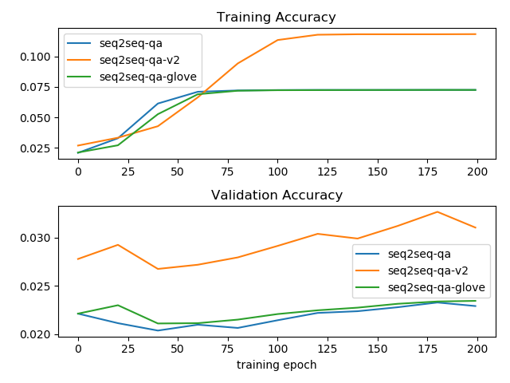

# keras-question-and-answering-web-api

Question answering system developed using seq2seq and memory network model in Keras

This project explores 

* Two different ways to merge the paragraph context and the question as the input of the encoder
* Two different encoding for the input of the encoder (one hot encoding and GloVe word2vec encoding)

The implementation of these models can be found in
 [keras_question_and_answering_system/library](keras_question_and_answering_system/library)
 
The implemented models include:

* [seq2seq.py](keras_question_and_answering_system/library/seq2seq.py): one-hot encoding input that is paragraph_context + ' Q ' + question
* [seq2seq_v2.py](keras_question_and_answering_system/library/seq2seq_v2.py): one-hot encoding input that is add(paragraph_context, RepeatVector(LSTM(question))) 
* [seq2seq_glove.py](keras_question_and_answering_system/library/seq2seq_glove.py): GloVe encoding input that is paragraph_context + ' Q ' + question
* [seq2seq_v2_glove.py](keras_question_and_answering_system/library/seq2seq_v2_glove.py): GloVe encoding input that is add(paragraph_context, RepeatVector(LSTM(question)))

 
The demo codes of using these models with [SQuAD](https://rajpurkar.github.io/SQuAD-explorer/) data set
can be found in [demo](demo)

# Usage

Before start, run the following command to install the keras, tensorflow, flask and other dependency modules:

```bash
sudo pip install -r requirements.txt
```

### SQuAD Data Set

The question answering models are trained using [SQuAD](https://rajpurkar.github.io/SQuAD-explorer/) data set and are available in the 
[demo/models](demo/models) directory. 

To view the SQuAD data set used for training, run the [squad_explore.py](demo/squad_explore.py) using the following command:

```bash
cd demo
python squad_explore.py
```

### Training 

The trained models are included in the [demo/models](demo/models) folder in the project.

The training was done using the SQuAD data set on with 200 epochs and batch size of 64 on tensorflow-gpu.
 
If you like to tune the parameters of the seq2seq and redo the training of the models, you can use the 
following command to run the training:

```bash
cd demo
python squad_seq2seq_train.py
```

The above commands will train one-hot encoding seq2seq model using SQuAD and store the trained model
in [demo/models/seq2seq-**"](demo/models)

Below is the source codes of [squad_seq2seq_train.py](demo/squad_seq2seq_train.py) which trains Seq2SeqQA on the SQuAD:

```python
from keras_question_and_answering_system.library.seq2seq import Seq2SeqQA
from keras_question_and_answering_system.library.utility.squad import SquADDataSet
import numpy as np


def main():
    random_state = 42
    output_dir_path = './models'

    np.random.seed(random_state)
    data_set = SquADDataSet(data_path='./data/SQuAD/train-v1.1.json')

    qa = Seq2SeqQA()
    batch_size = 64
    epochs = 200
    history = qa.fit(data_set, model_dir_path=output_dir_path,
                     batch_size=batch_size, epochs=epochs,
                     random_state=random_state)


if __name__ == '__main__':
    main()
```

Note that [SquADDataSet](keras_question_and_answering_system/library/utility/squad.py) is a sub class
of [QADataSet](keras_question_and_answering_system/library/utility/qa_data_utils.py). Therefore it is 
possible to train Seq2SeqQA on any data set that implements [QADataSet](keras_question_and_answering_system/library/utility/qa_data_utils.py)

If you like to train other models, you can use the same command above on another train python scripts:

* [squad_seq2seq_v2_train.py](demo/squad_seq2seq_v2_train.py): one hot encoding seq2seq but different from squad_seq2seq_train.py in that the paragraph context and the question are added after the LSTM + RepeatVector layer
* [squad_seq2seq_glove_train.py](demo/squad_seq2seq_glove_train.py): train on SQuAD on word-level (GloVe word2vec encoding) with input = paragraph_context + ' Q ' + question
* [squad_seq2seq_v2_glove_train.py](demo/squad_seq2seq_v2_glove_train.py): train on SQuAD on word-level (GloVe word2vec encoding) but different from squad_seq2seq_glove_train.py in that the paragraph context and the question are added after the LSTM + RepeatVector layer

The figure below compare the training accuracy and validation accuracy of various models using the script [squad_compare_models](demo/squad_compare_models.py):



### Predict Answers

With the trained models in [demo/models](demo/models), the predictors in the [demo](demo) can be used to load these model and predict answer based on the paragraph context and the question.

For example, to test the trained model for [Seq2SeqQA](keras_question_and_answering_system/library/seq2seq.py) on
 SQuAD data set, run the following command:

```bash
cd demo
python squad_seq2seq_predict.py
```

Below is the sample code of [squad_seq2seq_predict.py](demo/squad_seq2seq_predict.py) which tries to
predict the answer based on context provided and question being asked:

```python
from keras_question_and_answering_system.library.seq2seq import Seq2SeqQA
from keras_question_and_answering_system.library.utility.squad import SquADDataSet


def main():
    qa = Seq2SeqQA()
    qa.load_model(model_dir_path='./models')
    data_set = SquADDataSet(data_path='./data/SQuAD/train-v1.1.json')
    for i in range(20):
        index = i * 10
        paragraph, question, actual_answer = data_set.get_data(index)
        predicted_answer = qa.reply(paragraph, question)
        print('context: ', paragraph)
        print('question: ', question)
        print({'guessed_answer': predicted_answer, 'actual_answer': actual_answer})


if __name__ == '__main__':
    main()

```

Below show the console output from [squad_seq2seq_predict.py](demo/squad_seq2seq_predict.py):

```
...
{'guessed_answer': '19.7', 'actual_answer': '19.7%'}
context:  Father Joseph Carrier, C.S.C. was Director of the Science Museum and the Library and Professor of Chemistry and Physics until 1874. Carrier taught that scientific research and its promise for progress were not antagonistic to the ideals of intellectual and moral culture endorsed by the Church. One of Carrier's students was Father John Augustine Zahm (1851–1921) who was made Professor and Co-Director of the Science Department at age 23 and by 1900 was a nationally prominent scientist and naturalist. Zahm was active in the Catholic Summer School movement, which introduced Catholic laity to contemporary intellectual issues. His book Evolution and Dogma (1896) defended certain aspects of evolutionary theory as true, and argued, moreover, that even the great Church teachers Thomas Aquinas and Augustine taught something like it. The intervention of Irish American Catholics in Rome prevented Zahm's censure by the Vatican. In 1913, Zahm and former President Theodore Roosevelt embarked on a major expedition through the Amazon.
question:  What was the lifespan of John Augustine Zahm?
{'guessed_answer': 'evolution and science', 'actual_answer': '1851–1921'}
context:  The Lobund Institute grew out of pioneering research in germ-free-life which began in 1928. This area of research originated in a question posed by Pasteur as to whether animal life was possible without bacteria. Though others had taken up this idea, their research was short lived and inconclusive. Lobund was the first research organization to answer definitively, that such life is possible and that it can be prolonged through generations. But the objective was not merely to answer Pasteur's question but also to produce the germ free animal as a new tool for biological and medical research. This objective was reached and for years Lobund was a unique center for the study and production of germ free animals and for their use in biological and medical investigations. Today the work has spread to other universities. In the beginning it was under the Department of Biology and a program leading to the master's degree accompanied the research program. In the 1940s Lobund achieved independent status as a purely research organization and in 1950 was raised to the status of an Institute. In 1958 it was brought back into the Department of Biology as integral part of that department, but with its own program leading to the degree of PhD in Gnotobiotics.
question:  Around what time did Lobund of Notre Dame become independent?
{'guessed_answer': 'the 1940s', 'actual_answer': 'the 1940s'}
context:  As of 2012[update] research continued in many fields. The university president, John Jenkins, described his hope that Notre Dame would become "one of the pre–eminent research institutions in the world" in his inaugural address. The university has many multi-disciplinary institutes devoted to research in varying fields, including the Medieval Institute, the Kellogg Institute for International Studies, the Kroc Institute for International Peace studies, and the Center for Social Concerns. Recent research includes work on family conflict and child development, genome mapping, the increasing trade deficit of the United States with China, studies in fluid mechanics, computational science and engineering, and marketing trends on the Internet. As of 2013, the university is home to the Notre Dame Global Adaptation Index which ranks countries annually based on how vulnerable they are to climate change and how prepared they are to adapt.
question:  What does the Kroc Institute at Notre Dame focus on?
{'guessed_answer': 'international peace studies', 'actual_answer': 'International Peace studies'}
context:  About 80% of undergraduates and 20% of graduate students live on campus. The majority of the graduate students on campus live in one of four graduate housing complexes on campus, while all on-campus undergraduates live in one of the 29 residence halls. Because of the religious affiliation of the university, all residence halls are single-sex, with 15 male dorms and 14 female dorms. The university maintains a visiting policy (known as parietal hours) for those students who live in dormitories, specifying times when members of the opposite sex are allowed to visit other students' dorm rooms; however, all residence halls have 24-hour social spaces for students regardless of gender. Many residence halls have at least one nun and/or priest as a resident. There are no traditional social fraternities or sororities at the university, but a majority of students live in the same residence hall for all four years. Some intramural sports are based on residence hall teams, where the university offers the only non-military academy program of full-contact intramural American football. At the end of the intramural season, the championship game is played on the field in Notre Dame Stadium.
question:  How many dorms for males are on the Notre Dame campus?
{'guessed_answer': '2,000', 'actual_answer': '15'}
context:  This Main Building, and the library collection, was entirely destroyed by a fire in April 1879, and the school closed immediately and students were sent home. The university founder, Fr. Sorin and the president at the time, the Rev. William Corby, immediately planned for the rebuilding of the structure that had housed virtually the entire University. Construction was started on the 17th of May and by the incredible zeal of administrator and workers the building was completed before the fall semester of 1879. The library collection was also rebuilt and stayed housed in the new Main Building for years afterwards. Around the time of the fire, a music hall was opened. Eventually becoming known as Washington Hall, it hosted plays and musical acts put on by the school. By 1880, a science program was established at the university, and a Science Hall (today LaFortune Student Center) was built in 1883. The hall housed multiple classrooms and science labs needed for early research at the university.
question:  Who was the president of Notre Dame in 1879?
{'guessed_answer': 'rev . william corby', 'actual_answer': 'Rev. William Corby'}
context:  One of the main driving forces in the growth of the University was its football team, the Notre Dame Fighting Irish. Knute Rockne became head coach in 1918. Under Rockne, the Irish would post a record of 105 wins, 12 losses, and five ties. During his 13 years the Irish won three national championships, had five undefeated seasons, won the Rose Bowl in 1925, and produced players such as George Gipp and the "Four Horsemen". Knute Rockne has the highest winning percentage (.881) in NCAA Division I/FBS football history. Rockne's offenses employed the Notre Dame Box and his defenses ran a 7–2–2 scheme. The last game Rockne coached was on December 14, 1930 when he led a group of Notre Dame all-stars against the New York Giants in New York City.
question:  In what year did the team lead by Knute Rockne win the Rose Bowl?
{'guessed_answer': '1925', 'actual_answer': '1925'}
context:  Holy Cross Father John Francis O'Hara was elected vice-president in 1933 and president of Notre Dame in 1934. During his tenure at Notre Dame, he brought numerous refugee intellectuals to campus; he selected Frank H. Spearman, Jeremiah D. M. Ford, Irvin Abell, and Josephine Brownson for the Laetare Medal, instituted in 1883. O'Hara strongly believed that the Fighting Irish football team could be an effective means to "acquaint the public with the ideals that dominate" Notre Dame. He wrote, "Notre Dame football is a spiritual service because it is played for the honor and glory of God and of his Blessed Mother. When St. Paul said: 'Whether you eat or drink, or whatsoever else you do, do all for the glory of God,' he included football."
question:  Irvin Abell was given what award by Notre Dame?
{'guessed_answer': 'laetare medal', 'actual_answer': 'Laetare Medal'}
context:  The Rev. Theodore Hesburgh, C.S.C., (1917–2015) served as president for 35 years (1952–87) of dramatic transformations. In that time the annual operating budget rose by a factor of 18 from $9.7 million to $176.6 million, and the endowment by a factor of 40 from $9 million to $350 million, and research funding by a factor of 20 from $735,000 to $15 million. Enrollment nearly doubled from 4,979 to 9,600, faculty more than doubled 389 to 950, and degrees awarded annually doubled from 1,212 to 2,500.
question:  What was the size of the Notre Dame endowment when Theodore Hesburgh became president?
{'guessed_answer': '9 million', 'actual_answer': '$9 million'}
context:  In the 18 years under the presidency of Edward Malloy, C.S.C., (1987–2005), there was a rapid growth in the school's reputation, faculty, and resources. He increased the faculty by more than 500 professors; the academic quality of the student body has improved dramatically, with the average SAT score rising from 1240 to 1360; the number of minority students more than doubled; the endowment grew from $350 million to more than $3 billion; the annual operating budget rose from $177 million to more than $650 million; and annual research funding improved from $15 million to more than $70 million. Notre Dame's most recent[when?] capital campaign raised $1.1 billion, far exceeding its goal of $767 million, and is the largest in the history of Catholic higher education.
question:  When Malloy became president of Notre Dame what was the size of the endowment?
{'guessed_answer': '350 million', 'actual_answer': '$350 million'}
context:  Because of its Catholic identity, a number of religious buildings stand on campus. The Old College building has become one of two seminaries on campus run by the Congregation of Holy Cross. The current Basilica of the Sacred Heart is located on the spot of Fr. Sorin's original church, which became too small for the growing college. It is built in French Revival style and it is decorated by stained glass windows imported directly from France. The interior was painted by Luigi Gregori, an Italian painter invited by Fr. Sorin to be artist in residence. The Basilica also features a bell tower with a carillon. Inside the church there are also sculptures by Ivan Mestrovic. The Grotto of Our Lady of Lourdes, which was built in 1896, is a replica of the original in Lourdes, France. It is very popular among students and alumni as a place of prayer and meditation, and it is considered one of the most beloved spots on campus.
question:  In which architectural style is the Basilica of the Sacred Heart at Notre Dame made?
{'guessed_answer': 'french revival', 'actual_answer': 'French Revival'}
context:  The University of Notre Dame has made being a sustainability leader an integral part of its mission, creating the Office of Sustainability in 2008 to achieve a number of goals in the areas of power generation, design and construction, waste reduction, procurement, food services, transportation, and water.As of 2012[update] four building construction projects were pursuing LEED-Certified status and three were pursuing LEED Silver. Notre Dame's dining services sources 40% of its food locally and offers sustainably caught seafood as well as many organic, fair-trade, and vegan options. On the Sustainable Endowments Institute's College Sustainability Report Card 2010, University of Notre Dame received a "B" grade. The university also houses the Kroc Institute for International Peace Studies. Father Gustavo Gutierrez, the founder of Liberation Theology is a current faculty member.
question:  Notre Dame got a "B" for its sustainability practices from which entity?
{'guessed_answer': 'sustainable endowments institute', 'actual_answer': 'Sustainable Endowments Institute'}
context:  The College of Arts and Letters was established as the university's first college in 1842 with the first degrees given in 1849. The university's first academic curriculum was modeled after the Jesuit Ratio Studiorum from Saint Louis University. Today the college, housed in O'Shaughnessy Hall, includes 20 departments in the areas of fine arts, humanities, and social sciences, and awards Bachelor of Arts (B.A.) degrees in 33 majors, making it the largest of the university's colleges. There are around 2,500 undergraduates and 750 graduates enrolled in the college.
question:  How many BA majors does the College of Arts and Letters at Notre Dame offer?
{'guessed_answer': '33', 'actual_answer': '33'}
context:  The School of Architecture was established in 1899, although degrees in architecture were first awarded by the university in 1898. Today the school, housed in Bond Hall, offers a five-year undergraduate program leading to the Bachelor of Architecture degree. All undergraduate students study the third year of the program in Rome. The university is globally recognized for its Notre Dame School of Architecture, a faculty that teaches (pre-modernist) traditional and classical architecture and urban planning (e.g. following the principles of New Urbanism and New Classical Architecture). It also awards the renowned annual Driehaus Architecture Prize.
question:  Which prestigious prize does the School of Architecture at Notre Dame give out?
{'guessed_answer': 'driehaus architecture prize', 'actual_answer': 'Driehaus Architecture Prize'}
context:  The University of Notre Dame du Lac (or simply Notre Dame /ˌnoʊtərˈdeɪm/ NOH-tər-DAYM) is a Catholic research university located adjacent to South Bend, Indiana, in the United States. In French, Notre Dame du Lac means "Our Lady of the Lake" and refers to the university's patron saint, the Virgin Mary. The main campus covers 1,250 acres in a suburban setting and it contains a number of recognizable landmarks, such as the Golden Dome, the "Word of Life" mural (commonly known as Touchdown Jesus), and the Basilica.
question:  The school known as Notre Dame is known by a more lengthy name, what is it?
{'guessed_answer': 'university of notre dame du', 'actual_answer': 'University of Notre Dame du'}
context:  Besides its prominence in sports, Notre Dame is also a large, four-year, highly residential research University, and is consistently ranked among the top twenty universities in the United States  and as a major global university. The undergraduate component of the university is organized into four colleges (Arts and Letters, Science, Engineering, Business) and the Architecture School. The latter is known for teaching New Classical Architecture and for awarding the globally renowned annual Driehaus Architecture Prize. Notre Dame's graduate program has more than 50 master's, doctoral and professional degree programs offered by the five schools, with the addition of the Notre Dame Law School and a MD-PhD program offered in combination with IU medical School. It maintains a system of libraries, cultural venues, artistic and scientific museums, including Hesburgh Library and the Snite Museum of Art. Over 80% of the university's 8,000 undergraduates live on campus in one of 29 single-sex residence halls, each with its own traditions, legacies, events and intramural sports teams. The university counts approximately 120,000 alumni, considered among the strongest alumni networks among U.S. colleges.
question:  Where among US universities does Notre Dame rank?
{'guessed_answer': 'among the top twenty', 'actual_answer': 'among the top twenty'}
```

Other available scripts for testing the various deep learning models are:

* [squad_seq2seq_v2_predict.py](demo/squad_seq2seq_v2_predict.py)
* [squad_seq2seq_glove_predict.py](demo/squad_seq2seq_glove_predict.py)
* [squad_seq2seq_v2_glove_predict.py](demo/squad_seq2seq_v2_glove_predict.py)

Below show the console output from [squad_seq2seq_v2_predict.py](demo/squad_seq2seq_v2_predict.py):

```text
context:  Architecturally, the school has a Catholic character. Atop the Main Building's gold dome is a golden statue of the Virgin Mary. Immediately in front of the Main Building and facing it, is a copper statue of Christ with arms upraised with the legend "Venite Ad Me Omnes". Next to the Main Building is the Basilica of the Sacred Heart. Immediately behind the basilica is the Grotto, a Marian place of prayer and reflection. It is a replica of the grotto at Lourdes, France where the Virgin Mary reputedly appeared to Saint Bernadette Soubirous in 1858. At the end of the main drive (and in a direct line that connects through 3 statues and the Gold Dome), is a simple, modern stone statue of Mary.
question:  To whom did the Virgin Mary allegedly appear in 1858 in Lourdes France?
{'guessed_answer': 'saint bernadette soubirous', 'actual_answer': 'Saint Bernadette Soubirous'}
context:  Beyoncé Giselle Knowles-Carter (/biːˈjɒnseɪ/ bee-YON-say) (born September 4, 1981) is an American singer, songwriter, record producer and actress. Born and raised in Houston, Texas, she performed in various singing and dancing competitions as a child, and rose to fame in the late 1990s as lead singer of R&B girl-group Destiny's Child. Managed by her father, Mathew Knowles, the group became one of the world's best-selling girl groups of all time. Their hiatus saw the release of Beyoncé's debut album, Dangerously in Love (2003), which established her as a solo artist worldwide, earned five Grammy Awards and featured the Billboard Hot 100 number-one singles "Crazy in Love" and "Baby Boy".
question:  In what R&B group was she the lead singer?
{'guessed_answer': "destiny 's child", 'actual_answer': "Destiny's Child"}
context:  Beyoncé Giselle Knowles-Carter (/biːˈjɒnseɪ/ bee-YON-say) (born September 4, 1981) is an American singer, songwriter, record producer and actress. Born and raised in Houston, Texas, she performed in various singing and dancing competitions as a child, and rose to fame in the late 1990s as lead singer of R&B girl-group Destiny's Child. Managed by her father, Mathew Knowles, the group became one of the world's best-selling girl groups of all time. Their hiatus saw the release of Beyoncé's debut album, Dangerously in Love (2003), which established her as a solo artist worldwide, earned five Grammy Awards and featured the Billboard Hot 100 number-one singles "Crazy in Love" and "Baby Boy".
question:  When did Beyoncé release Dangerously in Love?
{'guessed_answer': '2003', 'actual_answer': '2003'}
context:  The phrase "in whole or in part" has been subject to much discussion by scholars of international humanitarian law. The International Criminal Tribunal for the Former Yugoslavia found in Prosecutor v. Radislav Krstic – Trial Chamber I – Judgment – IT-98-33 (2001) ICTY8 (2 August 2001) that Genocide had been committed. In Prosecutor v. Radislav Krstic – Appeals Chamber – Judgment – IT-98-33 (2004) ICTY 7 (19 April 2004) paragraphs 8, 9, 10, and 11 addressed the issue of in part and found that "the part must be a substantial part of that group. The aim of the Genocide Convention is to prevent the intentional destruction of entire human groups, and the part targeted must be significant enough to have an impact on the group as a whole." The Appeals Chamber goes into details of other cases and the opinions of respected commentators on the Genocide Convention to explain how they came to this conclusion.
question:  In the judgement, it is stated that the aim of the Genocide Convention, at its most simplest, is preventing the destruction of which victims?
{'guessed_answer': '', 'actual_answer': 'entire human groups'}
context:  The emergence of resistance of bacteria to antibiotics is a common phenomenon. Emergence of resistance often reflects evolutionary processes that take place during antibiotic therapy. The antibiotic treatment may select for bacterial strains with physiologically or genetically enhanced capacity to survive high doses of antibiotics. Under certain conditions, it may result in preferential growth of resistant bacteria, while growth of susceptible bacteria is inhibited by the drug. For example, antibacterial selection for strains having previously acquired antibacterial-resistance genes was demonstrated in 1943 by the Luria–Delbrück experiment. Antibiotics such as penicillin and erythromycin, which used to have a high efficacy against many bacterial species and strains, have become less effective, due to the increased resistance of many bacterial strains.
question:  What is the purpose of antibiotic treatment?
{'guessed_answer': 'survive high doses of antibiotics', 'actual_answer': 'survive high doses of antibiotics'}
context:  Frédéric François Chopin (/ˈʃoʊpæn/; French pronunciation: ​[fʁe.de.ʁik fʁɑ̃.swa ʃɔ.pɛ̃]; 22 February or 1 March 1810 – 17 October 1849), born Fryderyk Franciszek Chopin,[n 1] was a Polish and French (by citizenship and birth of father) composer and a virtuoso pianist of the Romantic era, who wrote primarily for the solo piano. He gained and has maintained renown worldwide as one of the leading musicians of his era, whose "poetic genius was based on a professional technique that was without equal in his generation." Chopin was born in what was then the Duchy of Warsaw, and grew up in Warsaw, which after 1815 became part of Congress Poland. A child prodigy, he completed his musical education and composed his earlier works in Warsaw before leaving Poland at the age of 20, less than a month before the outbreak of the November 1830 Uprising.
question:  Where did Chopin grow up?
{'guessed_answer': 'warsaw', 'actual_answer': 'Warsaw'}
context:  Frédéric François Chopin (/ˈʃoʊpæn/; French pronunciation: ​[fʁe.de.ʁik fʁɑ̃.swa ʃɔ.pɛ̃]; 22 February or 1 March 1810 – 17 October 1849), born Fryderyk Franciszek Chopin,[n 1] was a Polish and French (by citizenship and birth of father) composer and a virtuoso pianist of the Romantic era, who wrote primarily for the solo piano. He gained and has maintained renown worldwide as one of the leading musicians of his era, whose "poetic genius was based on a professional technique that was without equal in his generation." Chopin was born in what was then the Duchy of Warsaw, and grew up in Warsaw, which after 1815 became part of Congress Poland. A child prodigy, he completed his musical education and composed his earlier works in Warsaw before leaving Poland at the age of 20, less than a month before the outbreak of the November 1830 Uprising.
question:  In what era of music did Chopin compose?
{'guessed_answer': 'romantic', 'actual_answer': 'Romantic'}
context:  The iPod is a line of portable media players and multi-purpose pocket computers designed and marketed by Apple Inc. The first line was released on October 23, 2001, about 8½ months after iTunes (Macintosh version) was released. The most recent iPod redesigns were announced on July 15, 2015. There are three current versions of the iPod: the ultra-compact iPod Shuffle, the compact iPod Nano and the touchscreen iPod Touch.
question:  How many versions of the iPod currently exist?
{'guessed_answer': 'new york city', 'actual_answer': '3'}
context:  Spectre (2015) is the twenty-fourth James Bond film produced by Eon Productions. It features Daniel Craig in his fourth performance as James Bond, and Christoph Waltz as Ernst Stavro Blofeld, with the film marking the character's re-introduction into the series. It was directed by Sam Mendes as his second James Bond film following Skyfall, and was written by John Logan, Neal Purvis, Robert Wade and Jez Butterworth. It is distributed by Metro-Goldwyn-Mayer and Columbia Pictures. With a budget around $245 million, it is the most expensive Bond film and one of the most expensive films ever made.
question:  Which company made Spectre?
{'guessed_answer': 'eon productions', 'actual_answer': 'Eon Productions'}
context:  The 2008 Sichuan earthquake or the Great Sichuan earthquake, measured at 8.0 Ms and 7.9 Mw, and occurred at 02:28:01 PM China Standard Time at epicenter (06:28:01 UTC) on May 12 in Sichuan province, killed 69,197 people and left 18,222 missing.
question:  In what year did the earthquake in Sichuan occur?
{'guessed_answer': '2008', 'actual_answer': '2008'}
context:  New York—often called New York City or the City of New York to distinguish it from the State of New York, of which it is a part—is the most populous city in the United States and the center of the New York metropolitan area, the premier gateway for legal immigration to the United States and one of the most populous urban agglomerations in the world. A global power city, New York exerts a significant impact upon commerce, finance, media, art, fashion, research, technology, education, and entertainment, its fast pace defining the term New York minute. Home to the headquarters of the United Nations, New York is an important center for international diplomacy and has been described as the cultural and financial capital of the world.
question:  What city has been called the cultural capital of the world?
{'guessed_answer': 'new york city', 'actual_answer': 'New York'}
context:  Solar energy is radiant light and heat from the Sun harnessed using a range of ever-evolving technologies such as solar heating, photovoltaics, solar thermal energy, solar architecture and artificial photosynthesis.
question:  Where does solar energy come from?
{'guessed_answer': 'the sun', 'actual_answer': 'the Sun'}
context:  The territory that now constitutes Tajikistan was previously home to several ancient cultures, including the city of Sarazm of the Neolithic and the Bronze Age, and was later home to kingdoms ruled by people of different faiths and cultures, including the Oxus civilization, Andronovo culture, Buddhism, Nestorian Christianity, Zoroastrianism, and Manichaeism. The area has been ruled by numerous empires and dynasties, including the Achaemenid Empire, Sassanian Empire, Hephthalite Empire, Samanid Empire, Mongol Empire, Timurid dynasty, and the Russian Empire. As a result of the breakup of the Soviet Union, Tajikistan became an independent nation in 1991. A civil war was fought almost immediately after independence, lasting from 1992 to 1997. Since the end of the war, newly established political stability and foreign aid have allowed the country's economy to grow.
question:  What are some of the empires and dynasties that ruled this lane?
{'guessed_answer': 'the achaemenid empire , sassanian empire , hephthalite empire , samanid empire , mongol empire , timurid dynasty , and the russian empire', 'actual_answer': 'the Achaemenid Empire, Sassanian Empire, Hephthalite Empire, Samanid Empire, Mongol Empire, Timurid dynasty, and the Russian Empire'}
context:  Following the earthquake, Joseph I gave his Prime Minister even more power, and Sebastião de Melo became a powerful, progressive dictator. As his power grew, his enemies increased in number, and bitter disputes with the high nobility became frequent. In 1758 Joseph I was wounded in an attempted assassination. The Távora family and the Duke of Aveiro were implicated and executed after a quick trial. The Jesuits were expelled from the country and their assets confiscated by the crown. Sebastião de Melo prosecuted every person involved, even women and children. This was the final stroke that broke the power of the aristocracy. Joseph I made his loyal minister Count of Oeiras in 1759.
question:  Who was expelled from the country after the assassination attempt on Joseph I?
{'guessed_answer': 'the protestant evangelical church in germany', 'actual_answer': 'The Jesuits'}
context:  Buddhism /ˈbudɪzəm/ is a nontheistic religion[note 1] or philosophy (Sanskrit: धर्म dharma; Pali: धम्म dhamma) that encompasses a variety of traditions, beliefs and spiritual practices largely based on teachings attributed to Gautama Buddha, commonly known as the Buddha ("the awakened one"). According to Buddhist tradition, the Buddha lived and taught in the eastern part of the Indian subcontinent, present-day Nepal sometime between the 6th and 4th centuries BCE.[note 1] He is recognized by Buddhists as an awakened or enlightened teacher who shared his insights to help sentient beings end their suffering through the elimination of ignorance and craving. Buddhists believe that this is accomplished through the direct understanding and perception of dependent origination and the Four Noble Truths.
question:  How do Buddhists believe their suffering can be ended?
{'guessed_answer': 'through the direct understanding and perception of dependent origination and the four noble truths', 'actual_answer': 'through the direct understanding and perception of dependent origination and the Four Noble Truths'}
context:  Buddhism /ˈbudɪzəm/ is a nontheistic religion[note 1] or philosophy (Sanskrit: धर्म dharma; Pali: धम्म dhamma) that encompasses a variety of traditions, beliefs and spiritual practices largely based on teachings attributed to Gautama Buddha, commonly known as the Buddha ("the awakened one"). According to Buddhist tradition, the Buddha lived and taught in the eastern part of the Indian subcontinent, present-day Nepal sometime between the 6th and 4th centuries BCE.[note 1] He is recognized by Buddhists as an awakened or enlightened teacher who shared his insights to help sentient beings end their suffering through the elimination of ignorance and craving. Buddhists believe that this is accomplished through the direct understanding and perception of dependent origination and the Four Noble Truths.
question:  How many noble truths are there?
{'guessed_answer': '4', 'actual_answer': '4'}
context:  American Idol is an American singing competition series created by Simon Fuller and produced by 19 Entertainment, and is distributed by FremantleMedia North America. It began airing on Fox on June 11, 2002, as an addition to the Idols format based on the British series Pop Idol and has since become one of the most successful shows in the history of American television. The concept of the series is to find new solo recording artists, with the winner being determined by the viewers in America. Winners chosen by viewers through telephone, Internet, and SMS text voting were Kelly Clarkson, Ruben Studdard, Fantasia Barrino, Carrie Underwood, Taylor Hicks, Jordin Sparks, David Cook, Kris Allen, Lee DeWyze, Scotty McCreery, Phillip Phillips, Candice Glover, Caleb Johnson, and Nick Fradiani.
question:  Who created American Idol?
{'guessed_answer': 'simon fuller', 'actual_answer': 'Simon Fuller'}
context:  The 2008 Summer Olympics torch relay was run from March 24 until August 8, 2008, prior to the 2008 Summer Olympics, with the theme of "one world, one dream". Plans for the relay were announced on April 26, 2007, in Beijing, China. The relay, also called by the organizers as the "Journey of Harmony", lasted 129 days and carried the torch 137,000 km (85,000 mi) – the longest distance of any Olympic torch relay since the tradition was started ahead of the 1936 Summer Olympics.
question:  What was the theme for the torch relay?
{'guessed_answer': 'one world , one dream', 'actual_answer': 'one world, one dream'}
context:  The ultimate substantive legacy of Principia Mathematica is mixed. It is generally accepted that Kurt Gödel's incompleteness theorem of 1931 definitively demonstrated that for any set of axioms and inference rules proposed to encapsulate mathematics, there would in fact be some truths of mathematics which could not be deduced from them, and hence that Principia Mathematica could never achieve its aims. However, Gödel could not have come to this conclusion without Whitehead and Russell's book. In this way, Principia Mathematica's legacy might be described as its key role in disproving the possibility of achieving its own stated goals. But beyond this somewhat ironic legacy, the book popularized modern mathematical logic and drew important connections between logic, epistemology, and metaphysics.
question:  Why was Gödels finding ironic?
{'guessed_answer': "gödel could not have come to this conclusion without whitehead and russell 's book", 'actual_answer': "Gödel could not have come to this conclusion without Whitehead and Russell's book"}
context:  Located approximately 250 kilometres (160 mi) east of Puerto Rico and the nearer Virgin Islands, St. Barthélemy lies immediately southeast of the islands of Saint Martin and Anguilla. It is one of the Renaissance Islands. St. Barthélemy is separated from Saint Martin by the Saint-Barthélemy Channel. It lies northeast of Saba and St Eustatius, and north of St Kitts. Some small satellite islets belong to St. Barthélemy including Île Chevreau (Île Bonhomme), Île Frégate, Île Toc Vers, Île Tortue and Gros Îlets (Îlots Syndare). A much bigger islet, Île Fourchue, lies on the north of the island, in the Saint-Barthélemy Channel. Other rocky islets which include Coco, the Roques (or little Turtle rocks), the Goat, and the Sugarloaf.
question:  How many Miles East of Puerto Rico is St. Barts?
{'guessed_answer': '160', 'actual_answer': '160'}
```

### Running Web Api Server

Goto [demo_web](demo_web) directory and run the following command:

```bash
python flaskr.py
```

Now navigate your browser to http://localhost:5000

To use the question and answering system as web api, you can send the following curl command to the 
web api server running at http://localhost:5000

```bash
curl -H 'Content-Type: application/json' -X POST -d '{"agent":"seq2seq", "context":"...", "question":"..."}' http://localhost:5000/qa_api
```

And the following will be the json response:

```json
{
    "agent": "seq2seq",
    "context": "...",
    "question": "...",
    "answer": "..."
}
```

# Configure to run on GPU on Windows

* Step 1: Change tensorflow to tensorflow-gpu in requirements.txt and install tensorflow-gpu
* Step 2: Download and install the [CUDA® Toolkit 9.0](https://developer.nvidia.com/cuda-90-download-archive) (Please note that
currently CUDA® Toolkit 9.1 is not yet supported by tensorflow, therefore you should download CUDA® Toolkit 9.0)
* Step 3: Download and unzip the [cuDNN 7.4 for CUDA@ Toolkit 9.0](https://developer.nvidia.com/cudnn) and add the
bin folder of the unzipped directory to the $PATH of your Windows environment 

